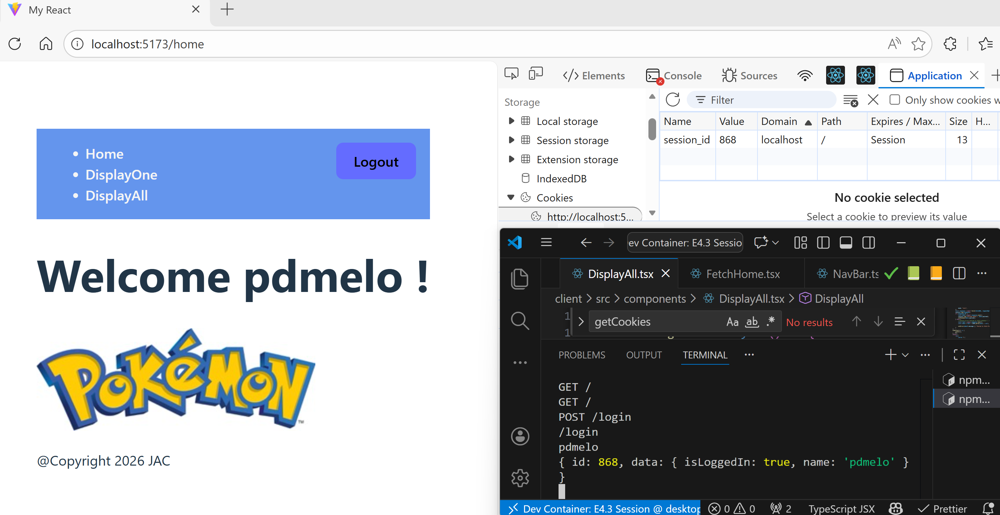
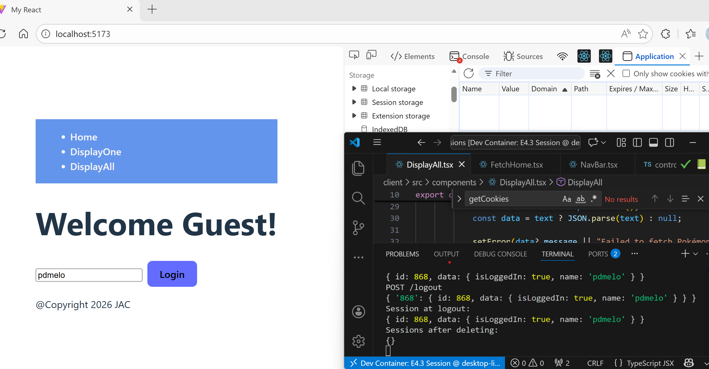
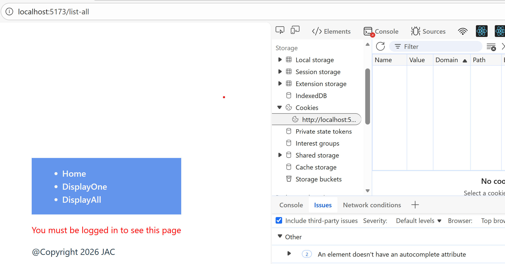

# 4.3 - Sessions

## 🎯 Objectives

- **Explain** how server-side sessions maintain user-specific data across requests.
- **Implement** authentication routes (login, logout) that create, manipulate, and destroy sessions.
- **Protect** specific routes based on session data.
- **Implement** a session expiration system to clear session data after a certain amount of time has passed.

## 🔨 Setup

1. Open your terminal and navigate to your ~/web-ii/exercises/ directory

2. Navigate to the [template repository](https://github.com/JAC-CS-Web-Programming-II-W26/E4.3-Sessions-Template)  and click Code -> 📋 to copy the URL:

   ```bash
   git clone <paste URL here>
   ```
3. Rename the cloned folder to `~/web-ii/exercises/4.3-sessions/`

4. Assuming Docker is started, in VS Code, hit `CMD/CTRL + SHIFT + P`, search + run `dev container: open folder in container`, and select the downloaded folder.

5. In the terminal of VS Code, hit the `+` icon to open a new terminal instance. Run `ls` to make sure you’re in the root directory of the exercise and you see `client` and `server` folders.

6. cd to `client` to run `npm run dev` to start the react server.

7. Open the website in the browser.

8. cd to `server`Run `npm run server` inside a JavaScript debug terminal to start the server.


## 🔍 Context

In the last exercise, we learned about sessions and cookies and how  we can use server-side sessions to store data on the server that is associated with a user's visit to a website. Sessions are typically implemented using cookies, but the session data is stored on the server, not the client's browser. This makes sessions more secure, as the client only has access to the session ID, not the session data itself.

In this exercise, we will implement a basic session system that allows users to log in and log out of a website. We will use sessions to store information about the user, such as their name, and restrict access to certain parts of the website to only logged-in users.

## 🚦 Let's Go

### Part 1: 🍪 Basic Sessions

1. Let’s start by understanding how sessions are implemented in this exercise.

  Open `sessions.ts` on the server side in the `src` folder.

  ```tsx
  // session.ts
  interface Session {
  	id: string;
  	data: Record<string, any>;
  }
  
  const sessions: Record<string, Session> = {};
  
  const createSession = (): Session => {
  	return {
  		id: Math.floor(Math.random() * 1000),
  		data: {},
  	};
  };
  ```

  🔍 What’s happening here?

  - The `Session` **interface** defines the structure of a session object. Each session has:
    - an `id`
    - a `data` object (used to store user-specific information)
  - The `sessions` **object** is a dictionary that stores all session objects.
    - Each session is stored using its `id` as the key.
    - Recall: a dictionary is a collection of key-value pairs, implemented in TypeScript using the `Record` type [Record type](https://www.typescriptlang.org/docs/handbook/utility-types.html#recordkeys-type).
  - The `createSession()` **function** generates a new session.
    - assigns a  random `id` and an empty `data` object.

  

2. 🔁 Retrieving a Session

  Now look at the `getSession()` function: 

  ```ts
  // session.ts
  export const getSession = (req: IncomingMessage) => {
  	const sessionId = getCookies(req)["session_id"];
  	let session: Session | undefined;
  
  	if (sessionId) {
  		session = sessions[sessionId];
  	}
  
  	return session;
  };
  ```

 This function attempts to retrieve the session associated with a user’s request.

- The `getSession()` function retrieves the session object associated with the user's request to the website.
- It:
  -  Reads the `session_id` cookie from the request
  - Checks if a session with that ID exists in the `sessions` object
  - Returns the session if found
  - If the user has a session ID cookie, the function retrieves the session object from the `sessions` object using the session ID. If the user does not have a session ID cookie (ex. first login to the site), the function creates a new session object and sets the session ID cookie to the new session's ID.


👉 If no session cookie exists (for example, on the user’s first visit), a new session should be created and stored.

**🛠️ Your Task**

Inside the **`getHome()` controller function**, follow the steps outlined in the comments:

1. Retrieve the session using `getSession()`
2.  If no session exists, create one
3. Set the response status code to `200`
4. Set a `"Set-Cookie"` header with the session ID. We learned how to do this from  [E4.1](/Notes/Week11/41-cookies?id=part-1-🍪-basic-cookies).

✅ Verify Your Work

After completing the implementation:

- Refresh the page and open your browser’s **DevTools → Application → Cookies**
  - Confirm that a `session_id` cookie has been created
  - Take note of its value

- Refresh the page again:
  - The same `session_id` should still be present (it should not change)
  - Check your terminal and verify that the `sessions` object is being logged on each request on the server side.


>[!note]
>**Key Takeaways**
>
>1. Sessions are a way to store data on the server that is associated with a user's visit to a website.
>2. Sessions are typically implemented using cookies.
>3. The session ID is stored in a cookie on the client's browser.
>4. The session data is stored on the server.
>5. The session ID is used to retrieve the session data from the server.


### Part 2: 🔓 Logging In

Now that we have a working session mechanism in place, let's implement a login system. 

>[!Note] 
>
>💡 In real applications, sessions are typically created **when a user logs in**, not when a page loads. We’ll update our code to follow this pattern.

#### 🧹 **Step 1: Cleanup**

Before adding login functionality, update your existing code:

- **In the `getHome()` controller:**
  - Comment out the code from Part 1 that:
    - retrieves the session
    - sets the `Set-Cookie` header
- **In `session.ts`:**
  - Comment out the code that creates a session inside `getSession()`
  - Sessions should now only be created during login

```ts
// else {
	// 	session = createSession();
	// 	sessions[session.id] = session;
	// }

....
	// if (!session) {
	// 	throw new Error(
	// 		"Session not found (you probably need to erase all browser cookies).",
	// 	);
	// }
```


####  🔌**Step 2: **: Create the Login Route on the server side

- Create a new route on the server: `POST /login`
- Connect it to the `login()` controller function

Inside `login()`:

1. Create a new session
2. Store it in the `sessions` object
3. Add user data to the session (e.g. `name`, `isLoggedIn`)
4. Set the `Set-Cookie` header with the session ID


####  🧑‍💻Step 3 **Add a Login Form**

Update the **`Home.tsx`** component:


1. Lets  Add the following code to the `Home.tsx` component:

  ```tsx
  <!-- home.tsx -->
  <>
  	<input
  	type="text"
  	value={userName}
      className="loginbutton"    
  	onChange={(e) => setUserName(e.target.value)}
  	placeholder="Enter username"
  	/>
  
  	<button onClick={handleLogin}>Login</button>
  </>
  ```

  - This form includes:

    - a single input field for the user’s name
    - a login button
    
- For simplicity, we are not using a password field

- When clicked, the button should trigger a login request ( a POST request to the `/login` route when submitted.)

- Further instructions are provided on the `Home.tsx`

- Review  `FetchHome.tsx` and `App.tsx` and update accordingly to comply with the `Home.tsx`

  

#### 🔄 **Step 4: Handle Login on the Client**

In **`Home.tsx`**:

- Implement the `handleLogin` function:
  - send a request to `/login`
  - include the `userName` in the request body
  - clear the input after login
- Update the UI:
  - If the user is logged in, display a welcome message using:
    - `session.isLoggedIn`
    - `session.name`

👉 Example:

- Logged in → *“Welcome, Ash!”*
- Not logged in → show login form

<div style="position:relative; width:100%; height:0px; padding-bottom:62.500%;">
<iframe allow="fullscreen;autoplay" allowfullscreen height="100%" src="https://pdmelo.github.io/420-4W6-Web-Programming-II/images/4.3.2-Sessions.mp4" width="100%" style="border:none; width:100%; height:100%; position:absolute; left:0px; top:0px; overflow:hidden; border-radius: 5px; ">
	</iframe>
</div>

#### 🔒 **Step 5: Restrict Access (Frontend)**

Only allow logged-in users to add Pokemon:

Only allow logged-in users to add Pokémon:

- In the **`getAllPokemon()` controller**:

  - Follow the comments to only send the form if the user is logged in

- In **`DisplayAll.tsx`**:

  - Only render the form if the user is logged in

####  🔍**Step 6: Test the Login System**

  - Start while logged out:
    - Restart the server (this clears all session data)
  - Log in using the form
  - Verify:
    - The session is created
    - The UI updates correctly

#### ⚠️ **Step 7: Test and Expose a Security Flaw (Bypassing the UI)**

There’s an important issue with our current design: Even  though there is no form to add a Pokemon, users can still send requests manually.

👉 Try this:

- Use  [cURL](../../references/curl/#post-requests)  to send a POST /pokemon request while logged out

- You’ll notice that a Pokémon is still added to the database ❗

Here is curl command example , to verify you can can add new pokemon  when logged in . Make sure you logged in first, and get the session cookie. Then try this command.
```bash
curl -v -X POST -H "Content-Type:application/json"  -b "session_id=your-sessionID" -d '{"name":"Meow","type":"Grass"}' http://localhost:3000/pokemon 
```

To fix this, follow the comment in the `createPokemon()` controller function to only allow logged-in users to add Pokemon.


#### 🛡️ **Step 8: Fix Authorization on the Server**

To fix this:

- Go to the **`createPokemon()` controller**
- Follow the existing comments to:
  - check if the user is logged in using the session
  - only allow the request if `isLoggedIn === true`
  - otherwise, reject the request (e.g. return **401 Unauthorized**)

> [!note]
> **Key Takeaways**
>
> 1. A login system allows users to authenticate themselves to a website.
>
> 2. Sessions are used to store information about the user's authentication status.
> 3. The session object stores information about the user, such as their name, to personalize the user's experience on the website.
> 4. The session object can be used to restrict access to certain parts of the website to only logged-in users.


### Part 3: 🔒 Logging Out

Now let’s implement a logout system to allow users to end their session.

#### 🔘 **Step 1: Add a Logout Button (Client)**

Update the **`NavBar.tsx`** component:

- Display the **Logout** button **only if the user is logged in**
- When clicked, it should trigger a logout request to the server

```tsx
<!-- Nav.tsx -->
	<>
	     {isLoggedIn && <button onClick={handleLogout}>Logout</button>}
	</>
```

The `handleLogout` function should:

1. Call the logout request
2. Update the UI (set `isLoggedIn` to `false`)
3. Redirect the user to the home page

#### 🔌 **Step 2: Create the Logout Route (Server)**

- Create a route: `POST /logout`
- Connect it to the `logout()` controller

Inside the `logout()` function:

1. Invalidate or remove the session on the server
2. Expire the session cookie

To  [expire the cookie](https://pdmelo.github.io/420-4W6-Web-Programming-II/#/Notes/Week11/cookies?id=%e2%8f%b3-expires-and-max-age), set the `Expires` attribute of the `Set-Cookie` header to a past date:

  ```ts
  new Date(new Date().getTime() - 5000).toUTCString();
  ```

This generates a timestamp in the past, causing the browser to delete the cookie

#### 🔍**Step 3: Verify Logout**

Test your implementation:

1. Log in with a username
2. Open browser **DevTools → Application → Cookies**
   - Note the `session_id` value
3. Click **Logout**
4. Verify:
   - The `session_id` cookie is removed or expired
   - The UI updates (Logout button disappears)
   - The user is redirected to the home page


To really understand how the new session is being set after logging out, let's walk through the following scenario:

| Request | Client Cookie | Server Cookie | Description |
|---------|---------------|---------------|-------------|
| POST `/login`  | `{}` | `{123}` | Client logs in, server redirects to the homepage with session cookie 123. |
| GET `/` | `{123}` | `{123}` | Client performs the redirect and sends the cookie with the request. Server responds OK with the cookie back. |
| POST `/logout` | `{123}` | `{---}` | Client logs out, server sets expired cookie, client deletes expired cookie. Client redirect to the logout component or back to login. |

>[!note]
>**Key Takeaways**
>
>1. A logout system allows users to de-authenticate themselves from a website.
>2. Logging out invalidates the session ID cookie, forcing the user to log in again to access restricted parts of the website.
>3. Logging out is important for security reasons, as it prevents unauthorized access to a user's account.


### Part 4: 👑 Bonus *Fix Session Cleanup (Advanced Security)*

When you logged out, you might have noticed that session data is not being cleared on the server. This is because we are only clearing the session ID cookie, not the session data on the server. This means if someone got a hold of the session ID, they could still access the website as if they were logged in.

<div style="position:relative; width:100%; height:0px; padding-bottom:62.500%;">
<iframe allow="fullscreen;autoplay" allowfullscreen height="100%" src="https://pdmelo.github.io/420-4W6-Web-Programming-II/images/4.3.3-Hijacking.mp4" width="100%" style="border:none; width:100%; height:100%; position:absolute; left:0px; top:0px; overflow:hidden; border-radius: 5px; ">
	</iframe>
</div>

This phenomenon is known as [**session hijacking**](https://en.wikipedia.org/wiki/Session_hijacking). To defend against this kind of attack, implement  to clear session data once the user logs out.

## 📥 Submission

1. Take a screenshot after you **log in** so that your name is displayed in the welcome message. Make sure to have your browser's dev tools open to the `Application` tab showing the session ID cookie, and the server terminal open on the side showing the session data object.
1. Take a screenshot after you **log out** .Clearing all the session data on the server side.
1. Take a Screen shot of either Display All or create Pokemon, preventing user when not logged in








Submit the screenshots on Moodle.

---

